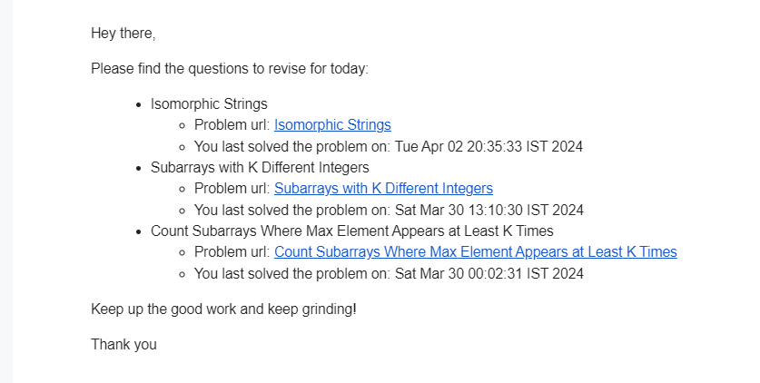

## nfyc-lc-revision-service

 

 

**Tired of forgetting what you learned on Leetcode**? This tool is here to help!

### Features
- **Leetcode Revision Algorithm Scheduler**: It looks at the problems you've already solved and creates a plan to review them again at the right time so you don't forget.
- **What to revise today**?: Get a list of problems to review each day straight to your inbox via email alerts. _No more manual excels!_  
  
- **Daily Challenge Reminder**: Receive daily email alerts reminding you if you haven't completed the daily challenge yet, helping you stay on track with your coding journey.

### Sonarqube Report:

 

